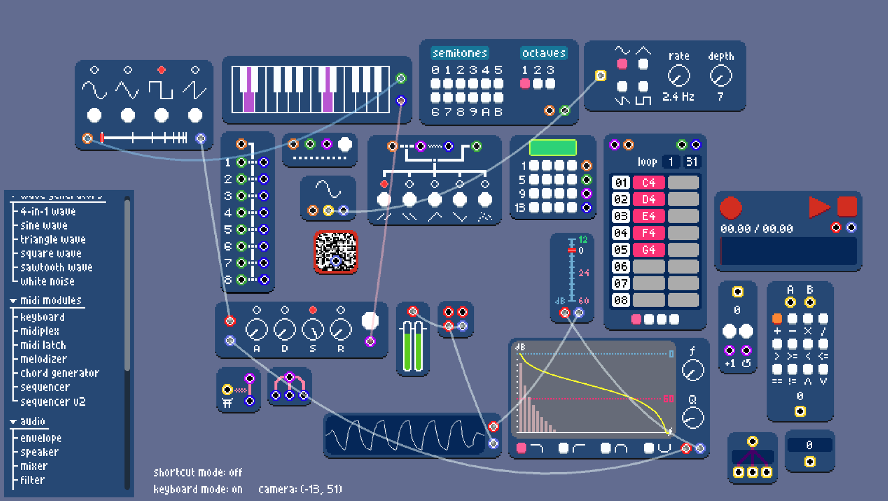

# modular music adventures
A devlog for a modular music system made with Godot.

## entries
- [**\[01\]**](devlogs/01_beginnings.md) **beginnings** - generating audio in Godot programatically, project inspirations
- [**\[02\]**](devlogs/02_audio-graphs.md) **audio graphs** - how will audio flow through the system?
- [**\[03\]**](devlogs/03_wave-generation.md) **wave generation** - synthesizing different wave shapes (triangle, square, sawtooth)
- [**\[04\]**](devlogs/04_envelopes.md) **envelopes** - shaping sound and giving it a voice with attack, decay, sustain, and release
- [**\[05\]**](devlogs/05_midi-keyboards-and-polyphony.md) **midi keyboards and polyphony** - using real-life midi input & how to play more than one note at a time
- [**\[06\]**](devlogs/06_biquad-filters.md) **biquad filters** - 
changing the character of a sound by playing with its frequency responses
- [**\[07\]**](devlogs/07_midi-modules.md) **more midi modules** - 
how can we treat MIDI signals as first class citizens? a summary of the chord generator, midi latch, and melodizer modules
- [**\[08\]**](devlogs/08_recording.md) **recording** - 
recording audio input to be sampled or played back later, as well as recording audio input from real life audio inputs, usually microphones
- [**\[09\]**](devlogs/09_saving-and-loading.md) **saving and loading** - 
how do we (de)serialize a project's state?