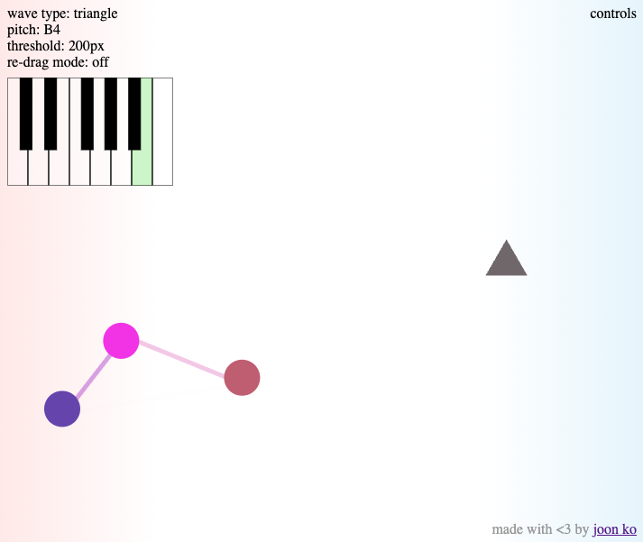
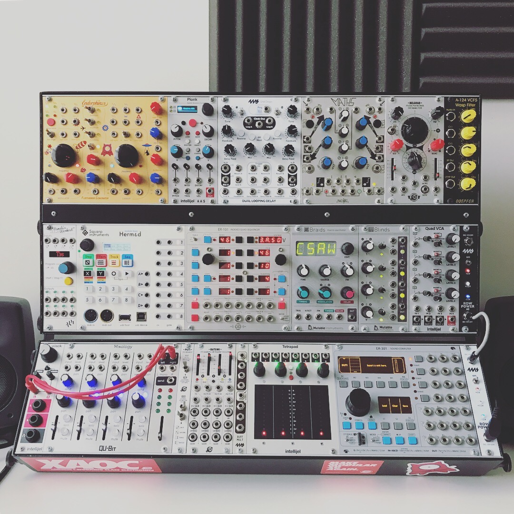
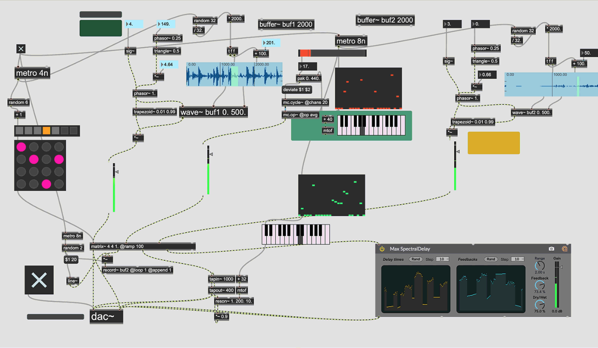

# \[01\] beginnings

It began not long after I'd finished my first [game jam](https://atau.itch.io/saute-and-slay) with a team of friends -- it was one of my first serious forays with the [Godot](https://godotengine.org/) game engine. I've grown to really like Godot so far, and it feels slimmer and more intuitive to me than Unity, which I didn't spend much time working with before wanting to try Godot instead. I may belong to a growing cohort of game dev hobbyists that have only ever known Godot as their creative medium.

Browsing through documentation, I came across the [AudioStreamGenerator](https://docs.godotengine.org/en/stable/classes/class_audiostreamgenerator.html#class-audiostreamgenerator) class. Unlike other audio streams that already "contain" audio to be played back by an [AudioStreamPlayer](https://docs.godotengine.org/en/stable/classes/class_audiostreamplayer.html), audio is instead programatically generated frame-by-frame. For example, to play a pure sine wave, we could write the following script (modified from Godot docs):

```C#
[Export] public AudioStreamPlayer Player { get; set; }

private AudioStreamGeneratorPlayback playback;
private float _mixRate; // Audio frames per second (in Hz). 44,100 Hz is typical. 
private float _frequency = 440f; // Frequency of the sine wave. Corresponds to pitch.
private double phase = 0.0;

public override void _Ready()
{
    var generator = (AudioStreamGenerator)Player.Stream;
    _mixRate = generator.MixRate;
    Player.Play();
    _playback = (AudioStreamGeneratorPlayback)Player.GetStreamPlayback();
    FillBuffer();
}

public void FillBuffer()
{
    float increment = _frequency / _mixRate;
    int framesAvailable = _playback.GetFramesAvailable();

    for (int i = 0; i < framesAvailable; i++)
    {
        _playback.PushFrame(Vector2.One * (float)Mathf.Sin(phase * Mathf.Tau));
        phase = Mathf.PosMod(phase + increment, 1.0);
    }
}
```

The important wave generation stuff happens in `FillBuffer()`. The rest is minutiae in setting up the audio player. Conceptually, this function "draws" a unit-amplitude sine wave at the given frequency by taking 44,100 samples per second. Although $y = sin(t)$ is a continuous function, we are discretizing it with enough fidelity that an audio speaker plays it as if it were a mathematically pure wave. This fidelity is what the `increment` variable represents: it's the phase offset between two samples. Another way to look at it is that `FillBuffer()` draws 440 periodic cycles of a sine wave every 44,100 frames. In other words, it draws one cycle of a sine wave every $\frac{44100}{440} \approx 100.2$ frames.

Now, a sine wave is a fairly simple example of audio that can be generated programmatically. But this tiny opening that the Godot engine has given may very well take me on an epic adventure that uses the humble AudioStreamGenerator as the backbone for a modular music system where Godot's strengths push the creative potential towards sky's limit.


## inspirations

The idea to develop a modular music system was not formed in a vacuum. A significant influence is from when I took a class called [Interactive Music Systems](https://musictech.mit.edu/ims/) in 2020 during my last undergrad semester at MIT. It was then that I first learned how audio could be generated programatically and sent between the analog and digital planes. I also gained a fondness of the intersection of software and music as a creative art. I created a cute [chord slinging thing](https://joon-ko.github.io/chord-sling/) for a homework assignment and built a [basic modular music sandbox with networked multiplayer](https://github.com/joon-ko/interval) as the final project with a friend.



Another core inspiration is analog modular synthesis. I have never taken on modular synths as a hobby mainly due to size and monetary constraints. However, I am vaguely aware of general concepts, the existence of the Eurorack, and have been fed videos from content creators that specialize in this stuff. I mainly feel inspired by 1) the chaotic web of wires that occurs from patching modules; and 2) the aesthetics that emerge from combining simple modules to make complex ones.



Finally, there are two modern DAWs (digital audio workstations) that I feel particularly inspired by: [Ableton Live](https://www.ableton.com/en/live/) and [Max](https://cycling74.com/products/max). Ableton remains my DAW of choice for whenever I feel musically creative in the non-interactive-systems way, and I love how modular, expressive, and automated it can feel, and I love that it is so seamlessly integrated with Max, which is the established audio-visual modular system that feels most similar to what I am going after. Its aesthetics and mode of interaction feel fundamentally different from this current project, but its building-block modularity and visual creative environment is very influential to this project.



An honorable mention goes out to the [Web Audio API](https://developer.mozilla.org/en-US/docs/Web/API/Web_Audio_API), which uses essentially the same concepts that I use for routing audio in this project via an audio node graph. I used this API for my chord slingy project and had a lot of fun working with it!

#### [\[02\] audio graphs](./02_audio-graphs.md) >>>