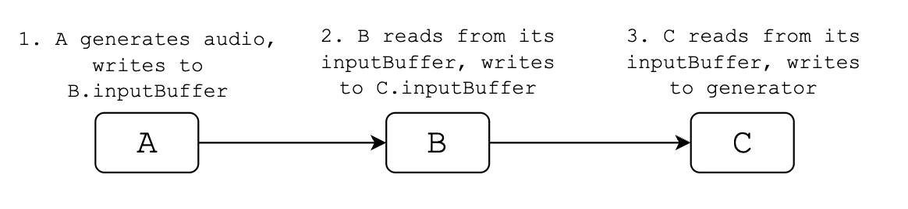
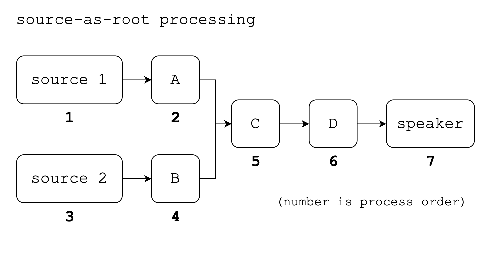
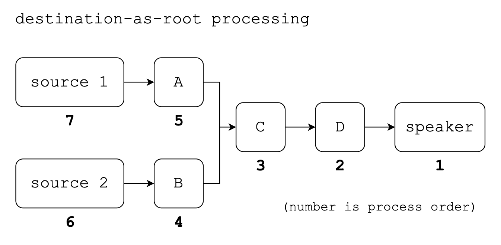
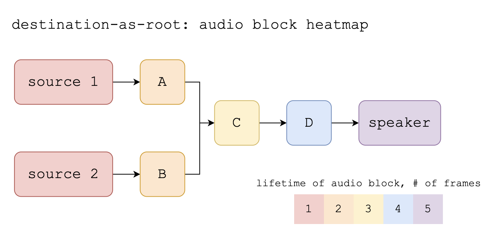
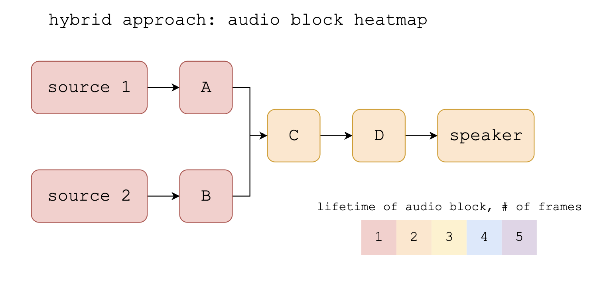

# \[02\] audio graphs

Constantly writing audio frames to an [AudioStreamGenerator](https://docs.godotengine.org/en/stable/classes/class_audiostreamgenerator.html#class-audiostreamgenerator) whenever space is available in the buffer is all fine, and is viable for isolated examples. But for a system as expandable as I have in mind, it'll be a lot easier if there are some ground rules in place that all modules that process audio have to follow.

First, I think modules should process audio at a predictable fixed rate and block size that balances speed and computational resources. 60 *processing frames* per second (pfps) sounds like a nice rate to me, so let's see what that looks like: at a mix rate of 44,100 Hz and 60 pfps, $\frac{44100}{60} = 735$ *audio frames* need to be pushed per process at the absolute minimum. I say absolute minimum because if an audio speaker is consuming audio frames faster than we can push them, those gaps are represented as zeroes in the signal data, which results in (to most, nasty) popping artifacts. In practice, I think we want a block size that's comfortably larger than 735 audio frames to minimize our chances of popping. I have a feeling that it could be useful to have a block size that's a power of two, so choosing $1024 = 2^{10}$ as the audio frame block size feels right to me. In other words, when a module processes audio, say via a `Process()` function, it reads from an input block of size 1024, does some manipulation of that input, then writes to an output block, also of size 1024. Keeping the block size uniform throughout like this should make reasoning about the flow of audio through a system much easier.

```C#
// AudioConstants.cs
public class AudioConstants
{
    public static float MIX_RATE = 44100f;
    public static int BLOCK_SIZE = 1024;
}
```

\(As an aside from the future, the mix rate will be bumped up to 48000 Hz. Why? Hopefully a later entry will get to that! ;\) But for now, let's go with 44100 Hz.\)

Since 1024 is greater than 735, this means that in the short term, we generate more audio frames faster than they get consumed, which builds up an audio frame surplus in the buffer. By choosing the length of the AudioStreamGenerator's buffer, we can determine *how large* this surplus will be. This is yet another key design choice: a larger buffer means more surplus, which means a lower chance of popping, but also means higher latency for a generated audio signal to ultimately get played. A smaller buffer inversely means less forgiveness for long process times, but lower latency. For now, I've chosen a generator buffer size of $1024 * 4 = 4096$. This has worked fine so far in practice, but it may be tweaked in the future. In any case, the buffer size has not felt like the primary source of latency in the system in the several months I've worked on the project. (We'll get to the primary source soon!)

Let's model the choices made so far. Let's call a module that processes audio an `AudioNode`.

```C#
// AudioNode.cs
public class AudioNode
{
    public float[] inputBuffer;
    public string nodeId;

    // Reads audio data from input, processes the data, and writes the result to output.
    // Called once every frame.
    public virtual void Process()
    {
        throw new Exception("ProcessNode() not yet implemented");
    }
}
```

Cool, now we should have some kind of representation for connections between audio modules. Suppose we have a sine wave module whose job is to generate a sine wave signal. Let's also say we have an audio speaker module that takes an input audio signal and pushes those frames to an AudioStreamGenerator. The sine wave module would have an audio output port that can connect to the speaker's audio input port. Then, every processing frame, the sine module calls its `Process()` method, which writes its 1024-frame output to the speaker module's 1024-frame `inputBuffer`. Then and only then does the speaker module call its `Process()` method, which is essentially just pushing to the AudioStreamGenerator.

```C#
// SpeakerNode.cs
public override void Process()
{
    Vector2[] outputBuffer = new Vector2[AudioConstants.BLOCK_SIZE];
    for (int i=0; i < AudioConstants.BLOCK_SIZE; i++)
    {
        outputBuffer[i] = new Vector2(inputBuffer[i], inputBuffer[i]);
    }

    _GetPlayback().PushBuffer(outputBuffer);
}
```

Note that there is an extra step where the input buffer is duplicated to both components of a Vector2. A Godot audio frame is stereo and is represented by a Vector2 where the X component is the left channel and the Y component is the right channel. Anyway, tracking directed connections (edges) between objects (vertices) sounds like the perfect use case for using a graph data structure. I'll call it the AudioNodeGraph.

```C#
// AudioNodeGraph.cs
public class AudioNodeGraph
{
    private List<SpeakerNode> _speakerNodes;

    // Keys are sources (outputs), and values are targets (inputs).
    private Dictionary<IOAddress, IOAddress> _connections;

    // Keeping an inverse of the conenctions dictionary in memory allows for O(1)
    // lookups for the output of any given input port.
    private Dictionary<IOAddress, IOAddress> _reverseConnections;

    private List<string> _processedNodes;
    private Queue<string> _processQueue;

    // Important graph methods
    public AudioNode CreateNode(AudioNodeType nodeType) { ... }
    public void RemoveNode(string nodeId) { ... }
    public void AddConnection(IOAddress source, IOAddress target) { ... }
    public void RemoveConnection(IOAddress source, IOAddress target) { ... }
    public void Process() { ... } // Where the magic happens!

    // Utility methods
    public bool IsAddressInUse(IOAddress address) { ... }
    public IOAddress GetOppositeAddress(IOAddress address) { ... }
}
```

Something that stumped me for a while was which order the graph should process audio blocks. For instance, we can imagine the speaker being the *last* module to be processed: in a chain of modules $A \rightarrow B \rightarrow C$ where $C$ is the speaker, we can imagine processing $A$ first, then $B$, then finally $C$. It's like the audio block is being baton-passed by modules in the relay race that is a single processing step.



This means that an audio block can go all the way from the source of its creation to the speaker in just one processing frame! This would be great for low latency.

However, there are some caveats to this approach. First, this processing model traverses the audio graph with each source (e.g. sine wave generator) as a distinct root. This is fine if the graph is a straight chain of connections with a single source. However, consider a mixer module that takes $n$ inputs and mixes them into one output. If we traverse with the sources as roots, we would need a way to "pause" the traversal at the mixer so that both sources can process up to each input of the mixer, after which the mixer is now unblocked and can continue processing through to the speaker. This is viable but adds complexity.



Currently, the project does not process the audio graph source-first. Instead, the graph is processed *destination-first*, i.e. with the speaker as root. This is an interesting inversion of order! If the first approach where we process source-to-destination can be described like a firing of a neuronal synapse, where audio is sent from one end to another in a single graph process, this second approach of destination-to-source feels more like a true flow of current, or like an esophagus passing food through peristalsis: each processing frame advances blocks of audio through by a single edge.



The benefit of this approach is that the implementation of processing the audio graph is delightfully simple:

```C#
public void Process()
{
    _processedNodes.Clear();
    _processQueue.Clear();

    // With the speaker as a starting point, process audio nodes via breadth-first graph traversal.
    // If a SpeakerNode is unable to push to the playback buffer, don't process this frame.
    if (speakerNode.ShouldProcess())
    {
        _processQueue.Enqueue(speakerNode.nodeId);
    }

    while (_processQueue.Count > 0)
    {
        var nodeId = _processQueue.Dequeue();
        var currentNode = GetAudioNode(nodeId);
        currentNode.Process();
        _processedNodes.Add(nodeId);

        // Push all sources of the current node to the process queue.
        // This ensures that on the next graph process, this node's input buffers
        // will have been updated by all its sources.
        for (int i=0; i<currentNode.inputCount; i++)
        {
            var address = new IOAddress(nodeId, IOFamily.Audio, IOType.Input, i);
            if (IsAddressInUse(address))
            {
                var sourceAddress = GetOppositeAddress(address);
                _processQueue.Enqueue(sourceAddress.nodeId);
            }
        }
    }
}
```

The downside of this approach is that we are introducing a good amount of latency due to the audio only advancing by one audio connection per processing frame. This is by far the primary source of latency in the system currently. We can even calculate this latency: if the edge-distance between source and destination node is $d$, then we incur at minimum $\frac{d}{60}$ seconds of latency, since $\frac{1}{60}$ is the duration of one processing frame. In fact, since we don't process if there's not enough space in the buffer, the latency is usually a bit more than $\frac{d}{60}$.



The solution to this latency issue, which is on the backlog and would be a fun devlog entry on its own, would be to use a hybrid approach. I think we should definitely stick to the speaker-as-root approach as it's much simpler to reason about, but instead of naïvely advancing audio by one edge connection each processing frame, we can identify chains that look like the $A \rightarrow B \rightarrow C$ mentioned earlier. These chains can be "reduced" by the processing context as if it were a single module whose input is the inputs of $A$ and whose output is the outputs of $C$. These subchains would be processed with source-as-root, so the first approach. This would mean that for single-chain systems, the latency/behavior would be identical to the source-as-root approach! For branching systems, there would still be more steps, but there would certainly be fewer steps.

