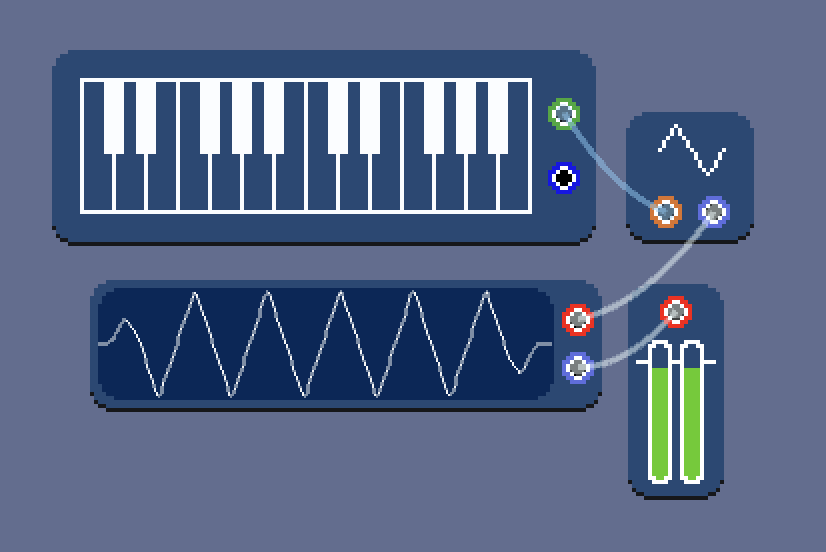

# \[04\] midi keyboards

In the last entry, we started playing our first sounds based on four common wave types: sine, triangle, square, and sawtooth. I also added a pitch slider to the four-types-in-one wave module that changes the fundamental frequency of the generated wave. But, other than this pitch slider, there's currently no way to affect the pitch.

I want this system to be fairly compatible with one's existing audio setup. To give three use cases:

1. Connecting MIDI keyboards should let you play synthesized sounds like a synth keyboard would: modules should recognize incoming MIDI "note on/off" signals, and even finer-grain signals like pitch bending. I've mainly been using this Amazon-Basics-ish [AKM320 MIDI keyboard](http://midiplus.com/html/akm320.html) for testing.

2. "Grid-like" controllers such as the [Novation Launchpad](https://us.novationmusic.com/launchpad) can be equipped with a shortcut mapping that allows for unfettered use of human touch to operate the system instead of a keyboard and mouse. Mappings should be possible with any MIDI controller, not just grid-like ones.

3. The system should support multi-channel audio input from any source, whether it be a microphone, a cabled instrument such as an electric bass, or an entire external audio system/workflow that outputs to our system's input!

The first use case we'll cover in this entry! The second won't be tackled for a while -- it's on the roadmap, but implementing a MIDI shortcut mapping system, while a critical feature, is still pretty premature. The third use case will be covered in [entry 09 - recording](./09_recording.md).

## MIDI support in Godot

Godot has an acceptable level of MIDI support out of the box! The main input class is [InputEventMIDI](https://docs.godotengine.org/en/stable/classes/class_inputeventmidi.html). This class has all the aspects of a MIDI signal that one would ever need: channel, controller number and value for generic control, MIDI messages like note on/off, pitch bend, note velocity and pressure, and generic control value changes! This is essentially stuff that comes to us from real-world controllers for free, and it's up to us to use that information or not. For now, we only care about the MIDI signal's `Pitch` and `Message` (specifically `MIDIMessage.NoteOn` and `MIDIMessage.NoteOff`).

The game has to call [OS.OpenMidiInputs()](https://docs.godotengine.org/en/stable/classes/class_os.html#class-os-method-open-midi-inputs) before Godot can receive InputEventMIDI events from real-world MIDI controllers. We will also initialize InputEventMIDI events from scratch sometimes in order to route MIDI signals through the audio graph.

To give a sketch of how MIDI events get received and routed: first, the **keyboard module** checks for `InputEventMIDI` events by hooking into Godot's built-in `_Input(InputEvent @event)` method.

```C#
    public override void _Input(InputEvent @event)
    {
        if (@event is InputEventMidi)
        {
			InputEventMidi midiEvent = (InputEventMidi)@event;
			EmitSignal(SignalName.MidiEvent, midiEvent, audioNode.nodeId, midiOutput.index);
        }
        // ...
    }
```

It emits a `MidiEvent` signal that is received by the AudioNodeGraph's `OnMidiEvent` method, which checks which module the signal came from and seeing if that module's MIDI output port is connected to anything. If it is, we call that target module's `OnMidiInput` method with the received MIDI event.

```C#
    public void OnMidiEvent(InputEventMidi midiEvent, string nodeId, int index)
    {
        var address = new IOAddress(nodeId, IOFamily.Midi, IOType.Output, index);
        if (!IsAddressInUse(address))
        {
            return;
        }

        var targetNode = GetTargetAudioNodeFromSourceAddress(address);
        targetNode.entity.OnMidiInput(midiEvent);
    }
```

The `OnMidiInput` method, is where we can actually do stuff with the event, like read its pitch and adjust the wave module's frequency accordingly.

```C#
// WaveEntity.cs
public override void OnMidiInput(InputEventMidi midiEvent)
{
    var newFrequency = audioUtils.GetFrequency(midiEvent.Pitch);
    if (midiEvent.Message == MidiMessage.NoteOn)
    {
        audioNode.BaseFrequency = newFrequency;
    }
}
```

`audioUtils.GetFrequency(int pitch)` is a method that converts a MIDI pitch number to the actual frequency of the pitch. There's a data file that's read into a midi-pitch-to-frequency dictionary on game initialization.

```C#
// AudioUtils.cs
public float GetFrequency(int midiPitch)
{
    return _midiToFrequencyDict[midiPitch];
}
```

Here's a segment of what `midi_frequency_map.txt` looks like:

```
60,C,4,261.626
61,C#,4,277.183
62,D,4,293.665
63,D#,4,311.127
64,E,4,329.628
65,F,4,349.228
66,F#,4,369.994
67,G,4,391.995
68,G#,4,415.305
69,A,4,440
70,A#,4,466.164
71,B,4,493.883
72,C,5,523.251
```

The columns, in order, are MIDI pitch, pitch name, pitch octave, and frequency. The data was referenced from tables online [such as this one](http://midi.teragonaudio.com/tutr/notefreq.htm).

Okay, so now what happens when we connect a keyboard module to a wave module, which is connected to a speaker? We get melody!



More fun things like pitch bending will probably come much further down the line. For now, just being able to affect pitch is enough. You will notice, though, that although we now have a notion of melody, we don't have a notion yet of *voice*: the wave is playing at a shrill, constant volume. We'll tackle how to shape wave amplitudes to give it voice in the next entry.

## A fun aside on pitch

For any given pitch, the octave above is twice that pitch's frequency, and the octave below is one-half that pitch's frequency. So for example, the pitch A4 is 440 Hz, and A5 the octave above is 880 Hz while A3 the octave below is 220 Hz. Since there are twelve semitones between any two octaves, the *frequency ratio* between two semitones is the twelth root of two. This gives a formula to get from any pitch's frequency to any other pitch's frequency based on their interval: if the starting MIDI pitch is $p_s$ and the ending MIDI pitch is $p_e$, then the frequency of the new pitch is

$$f_{\mathrm{new}} = f_{\mathrm{old}}\cdot(\sqrt[12]{2})^{p_{e}-p_{s}}.$$

This is called [12-tone equal temperament](https://en.wikipedia.org/wiki/12_equal_temperament) (12-ET or TET) tuning.

This gives a logarithmic relationship between perceived pitch and frequency, which we will have to deal with if we want to modify a pitch in terms of absolute frequency with things like low-frequency oscillators. For example, if we take a pitch A4 = 440 Hz and apply a 220 Hz low-frequency oscillator on its frequency, we will get the potentially undesired effect of the pitch wobble sounding like it only goes about half an octave above the reference pitch, but an entire octave below the reference pitch! We would need to normalize the LFO to oscillate logarithmically if we want the same interval of pitch wobble above and below the reference pitch.

#### <<< [\[03\] wave-generation](./03_wave-generation.md) | [\[05\] envelopes](./05_envelopes.md) >>>