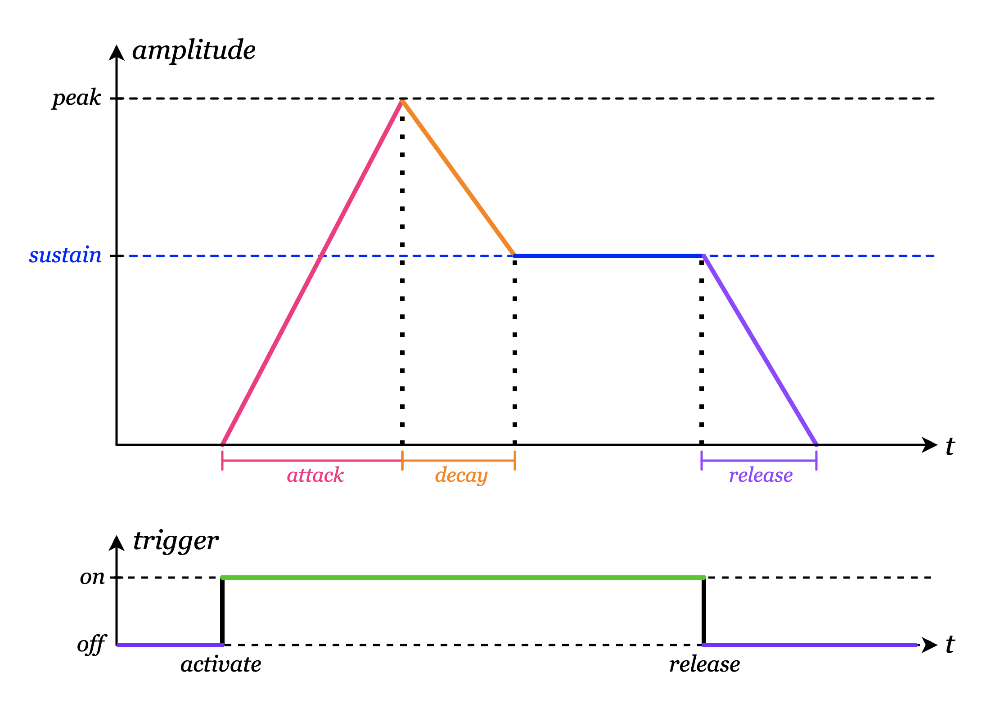

# \[05\] envelopes

There are probably many different ways one can model the "shaping" of audio, which is essentially controlling an audio signal's amplitude over time. Currently, we aren't doing any shaping at all, essentially letting the signal blare constantly at full volume. For this project's current juncture, we're going to try implementing a basic linear ADSR envelope, which has enough functionality for our needs while leaving enough room for more nuanced, non-linear envelopes down the line.

## ADSR

ADSR stands for *attack*, *decay*, *sustain*, and *release*. They are the four main parameters in a basic envelope:
- **Attack** is the time it takes for the signal to go from zero to peak amplitude once the trigger or gate is activated.
- **Decay** is the time it takes for the signal to go from peak amplitude to the *sustain* amplitude.
- **Sustain** is the proportion of peak amplitude to sustain the signal as long as the trigger or gate is being held. Note that this is not a length of time like the other parameters.
- **Release** is the time it takes for the signal to go from the sustain amplitude to zero once the trigger or gate is released.



By varying these four parameters, we can shape audio signals in surprisingly flexible ways. High attack or release lends itself to pad-like synth sounds that fade in slowly. Low decay and zero sustain lends itself to quick staccato-like stabs of sound. Low attack and decay with non-peak sustain emulates accents. Note that envelopes rely on a *trigger* or *gate* signal to dictate the envelope's stage. (We will use gate and trigger interchangeably from now on.) Activating the trigger takes the envelope progressively through the attack, decay, and sustain stages: the envelope remains at the sustain stage for as long as the trigger is held down. Any time the trigger is released, the envelope immediately goes into the release stage, no matter what stage it's currently in. Therefore, it's possible for envelopes to skip the sustain or even decay stage entirely if the trigger is activated for a sufficiently short amount of time.

To implement the envelope module in our system, we'll make it have one audio input and one audio output, as well as a new type of IO port called a *trigger input* which functions as the envelope trigger signal. The keyboard module has a trigger output port that can connect to the envelope's trigger input. The audio input is usually a constant-volume audio source like the output of the wave module, and the envelope functions like a passthrough that also does *variable-gain shaping* based on the trigger signal and the ADSR parameters. That is, the audio signal's frequency spectrum is preserved, and just the amplitude is modified.

The audio code for the envelope is a bit clunky due to needing to handle edge cases around early trigger releases. There is a good amount of interpolation to calculate the current amplitude factor to multiply the input signal by. I've added comments just for this devlog entry for the sake of explanation.

```C#
// EnvelopeNode.cs
public override void Process()
{
    // Beforehand, the output buffer is located and assigned to the `buffer` array.
    // ...

    for (int i=0; i < AudioConstants.BLOCK_SIZE; i++)
    {
        if (_stage == EnvelopeStage.Inactive)
        {
            buffer[i] = 0f;
            continue;
        }

        // If we're already in the sustain stage, we don't need to handle the case
        // where we transition between two envelope stages in the middle of a block.
        if (_stage == EnvelopeStage.Sustain)
        {
            _amplitudeFactor = SustainValue;
            buffer[i] = _amplitudeFactor * inputBuffer[i];
            continue;
        }

        // _currentFrame is the current frame in the current stage.
        // It's reset to 0 on every stage transition, and its maximum value is totalFrames.
        int totalFrames = _TotalStageFrames();
        float stageProportion = _currentFrame / (float)totalFrames;

        if (_stage == EnvelopeStage.Attack)
        {
            // This clunky flag handles the edge case where we re-trigger the envelope
            // before the envelope has enough time to fully release the last trigger.
            // This way, the correct initial attack amplitude is used for amplitude interpolation.
            if (!_initialAttackAmplitudeMeasured)
            {
                _initialAttackAmplitude = _amplitudeFactor;
                _initialAttackAmplitudeMeasured = true;
            }

            // Note that we treat the "peak amplitude" as 1.0, or the amplitude of the input signal.
            // This can potentially be a fifth parameter if the module designer so chooses.
            _amplitudeFactor = _Lerp(_initialAttackAmplitude, 1.0f, stageProportion);
            buffer[i] = _amplitudeFactor * inputBuffer[i];

            if (++_currentFrame >= totalFrames)
            {
                _stage = EnvelopeStage.Decay;
                _initialAttackAmplitudeMeasured = false;
                _currentFrame = 0;
            }
            continue;
        }

        if (_stage == EnvelopeStage.Decay)
        {
            _amplitudeFactor = _Lerp(1.0f, SustainValue, stageProportion);
            buffer[i] = _amplitudeFactor * inputBuffer[i];

            if (++_currentFrame >= totalFrames)
            {
                _stage = EnvelopeStage.Sustain;
                _currentFrame = 0;
            }
            continue;
        }

        if (_stage == EnvelopeStage.Release)
        {
            if (!_initialReleaseAmplitudeMeasured)
            {
                _initialReleaseAmplitude = _amplitudeFactor;
                _initialReleaseAmplitudeMeasured = true;
            }

            _amplitudeFactor = _Lerp(_initialReleaseAmplitude, 0f, stageProportion);
            buffer[i] = _amplitudeFactor * inputBuffer[i];

            if (++_currentFrame >= totalFrames)
            {
                _stage = EnvelopeStage.Inactive;
                _currentFrame = 0;
            }
        }
    }
    return;
}

// Calculates the number of audio frames in the current envelope stage.
private int _TotalStageFrames()
{
    if (_stage == EnvelopeStage.Inactive || _stage == EnvelopeStage.Sustain)
    {
        throw new Exception("_TotalStageFrames() should not be called for inactive or sustain stages");
    }

    float secondsInStage = 0;
    if (_stage == EnvelopeStage.Attack)
    {
        secondsInStage = AttackValue / 1000f;
    }
    else if (_stage == EnvelopeStage.Decay)
    {
        secondsInStage = DecayValue / 1000f;
    }
    else if (_stage == EnvelopeStage.Release)
    {
        secondsInStage = ReleaseValue / 1000f;
    }

    return Mathf.RoundToInt(AudioConstants.MIX_RATE * secondsInStage);
}

// Linearly interpolates between two values given a proportion where 0 is the start value
// and 1 is the end value.
private float _Lerp(float start, float end, float proportion)
{
    return (start * (1 - proportion)) + (end * proportion);
}
```

Hehe, I told you it'd be clunky! But hey, as long as it looks good enough, we can just forget about the code, right? Here's a demo of the envelope in action! Now our waves have voices! 🥹

https://github.com/user-attachments/assets/14c433af-b98f-4801-a4e8-707d9f9b7315

I really like this aesthetic of tactile knobs and LED indicator lights for each stage.

I would like to include more nuanced envelope curves: right now, the curve interpolations are linear, which is not the smoothest-sounding at times, especially when the attack, decay, or release is very short. Being able to configure which type of curve to use for each envelope stage, as well as showing the actual visual for the envelope curve itself, is an additional set of features I'd like to add later on.

Once I got envelope modules working, I started getting a bit more excited about this project. It felt like there really was potential to take the project really far and I started getting a lot more motivation to work on it! I immediately started thinking of a way to address that I thought was the next obvious limitation: currently, we only have one voice. If I hold two keys at the same time on my MIDI keyboard, we only hear the pitch of the "last" key that gets pressed. To support multiple voices, i.e. *polyphony*, we'll need to come up with a creative way to split a "polyphonic" MIDI signal into several monophonic MIDI signals. We'll tackle that in the next entry!

#### <<< [\[04\] midi keyboards](./04_midi-keyboards.md) | [\[06\] polyphony](./06_polyphony.md) >>>
