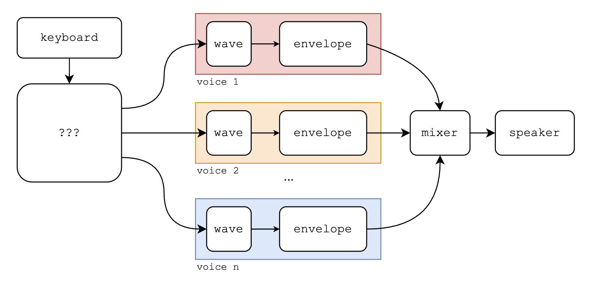
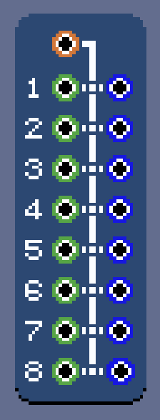

# \[06\] polyphony

I want to create a setup that supports polyphony: like synth keyboards, an arbitrary number of voices with chords of any size should be possible. Currently, however, the wave module has no capacity for multiple pitches, and can only produce one wave. If I connect a keyboard to a sine wave and press two notes at the same time, there will simply be a race condition where the last key to get pressed is played. Similarly, the envelope module has no capacity for multiple voices, i.e. no ability to play multiple envelopes triggered at arbitrary points in time.

If we only have the current building blocks we have now to support $n$ voices, it seems like we'll need at minimum $n$ wave generators and $n$ envelopes. There would need to be some module that can "split" a MIDI signal with $n$ keys held down into $n$ different MIDI channels with each held key. Each MIDI channel would be the MIDI input to a single wave-envelope chain.



After tinkering with possible designs for a while, I came up with what I call the *midiplexer*, a play on [multiplexer](https://en.wikipedia.org/wiki/Multiplexer).



It has one MIDI input and 8 different MIDI and trigger outputs! The 8 MIDI outputs can be viewed as "monophonic" MIDI signals, as there is a guarantee from the midiplexer that no more than one note will be pressed at a time.

```C#
// Snippet of MidiplexEntity.cs
public partial class MidiplexEntity : BaseEntity
{
	// When ports are released, they are re-added here.
	// The lowest open port index is used first.
	private PriorityQueue<int, int> openPorts;

	// Keys are MIDI pitches, values are port indices.
	public Dictionary<int, int> noteDictionary;

	// Utility array for operating the port lights.
	private bool[] used;

    // ...
}
```

The midiplexer maintains a priority queue of capacity 8 that serve as ports. When a MIDI pitch comes in, it's assigned to the *lowest open port* and passes the signal through the MIDI and trigger output at that port. A dictionary keeps track of which port a pitch is assigned to. When a held MIDI pitch is released, its assigned port is released, allowing for a new note that comes in to take that port.

```C#
public override void _Ready()
{
    // ...
    for (int i=0; i < 8; i++)
    {
        openPorts.Enqueue(i, i);
    }
    // ...
}

public override void OnMidiInput(InputEventMidi midiEvent)
{
    var pitch = midiEvent.Pitch;
    if (midiEvent.Message == MidiMessage.NoteOn)
    {
        if (openPorts.Count == 0)
        {
            GD.Print("No open ports to support incoming MIDI note");
            return;
        }

        if (noteDictionary.ContainsKey(pitch))
        {
            GD.Print($"Midiplex already contains pitch {pitch} on port {noteDictionary[pitch]}");
            return;
        }

        var portIndex = openPorts.Dequeue();
        noteDictionary[pitch] = portIndex;
        used[portIndex] = true;

        EmitSignal(SignalName.MidiEvent, midiEvent, audioNode.nodeId, portIndex);
        EmitSignal(SignalName.TriggerEvent, true, pitch, audioNode.nodeId, portIndex);
        return;
    }

    if (midiEvent.Message == MidiMessage.NoteOff)
    {
        var portIndex = noteDictionary[pitch];
        noteDictionary.Remove(pitch);
        used[portIndex] = false;

        openPorts.Enqueue(portIndex, portIndex);

        EmitSignal(SignalName.MidiEvent, midiEvent, portIndex);
        EmitSignal(SignalName.TriggerEvent, false, pitch, audioNode.nodeId, portIndex);
        return;
    }
}
```

All together, here's what the midiplexer with two ports connected to two wave-envelope chains sounds like:

https://github.com/user-attachments/assets/f4495b8d-fb36-4988-9a0d-052c273aa4d4

It's nice and really tickles the brain to have almost every module have some visual indication that it's doing its thing. The combination of two triangle waves looks really hecking cool.

Also, note that when I tried playing a third held note, it did not sound, because we never connected the third port! This having to create a separate wave-envelope chain for each port is quite tedious, although it does give a tremendous amount of flexibility. Hopefully, a copy-paste feature in the future will make things less tedious. Also, although the midiplexer has 8 ports currently, it could be nice to have other sizes like 4 or even 16 ports.

I definitely want to create a more integrated module in the future that essentilly crunches everything shown in the demo above into a single unit. I would probably call these heftier modules with built-in wave generation and envelope modulation *instruments*.

#### <<< [\[05\] envelopes](./05_envelopes.md) | [\[07\] biquad filters](./07_biquad-filters.md) >>>
