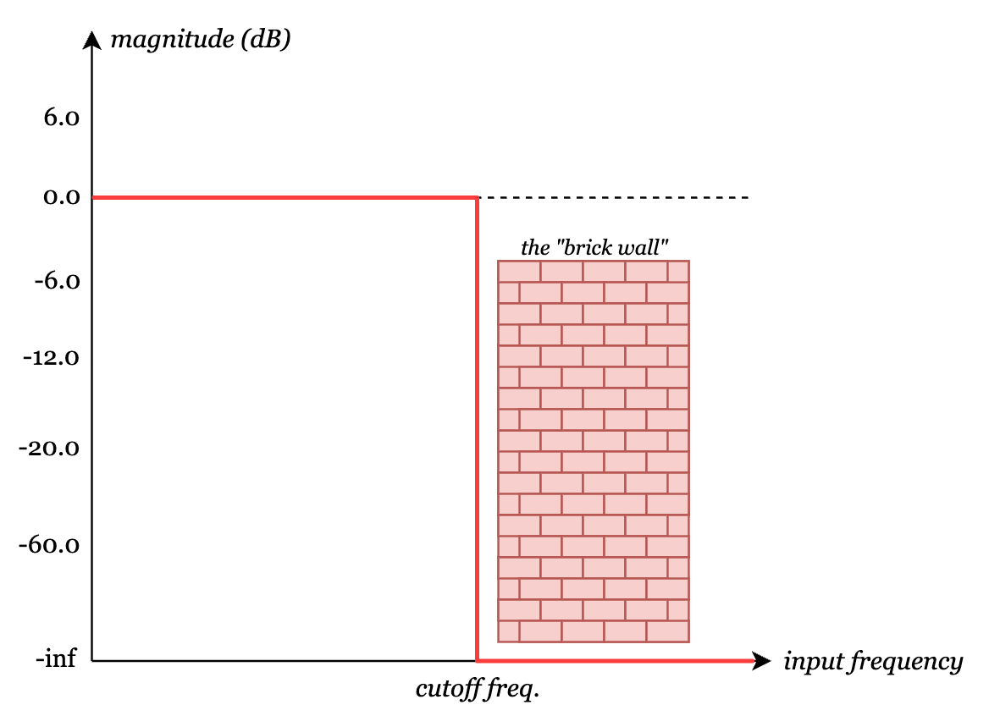

# \[07\] biquad filters

Up to now, we've been able to work with an audio signal's time-series data (1024 frames per block) and do straightforward pointwise manipulations on them. For example, the envelope module multiplies each audio frame pointwise by an amplitude factor that varies along a short section of an envelope curve. Another simple example is the *mixer*: it takes each audio input and sums all of them up pointwise, then normalizes this sum by dividing by the number of inputs.

```C#
// MixerNode.cs
public override void Process()
{
    // ...
    var normalizationFactor = 1f / connectedInputIndices.Count;
    for (int i=0; i < AudioConstants.BLOCK_SIZE; i++)
    {
        var sum = 0f;
        foreach (int inputIndex in connectedInputIndices)
        {
            sum += inputBuffers[inputIndex][i];
        }
        targetInputBuffer[i] = sum * normalizationFactor;
    }
}
```

Yet another example is the *gain* module, which multiplies each audio frame pointwise by a constant factor that is adjustable.

```C#
// GainNode.cs

// Gain in dB.
public float Gain { get; set; } = 0f;

public override void Process()
{
    // ...
    var linearGain = Mathf.DbToLinear(Gain);
    for (int i=0; i < AudioConstants.BLOCK_SIZE; i++)
    {
        targetBuffer[i] = linearGain * inputBuffer[i];
    }
}
```

But now, I wanted to tackle something that would take me into the frequency domain. I picked the low-pass filter as the first module to do so. It was several weeks of doing what felt like research instead of doing actual development, but in the end I found some holy grails of information that would get me much more than just the low-pass filter!

## researching filters

So I set out to implement a low-pass filter and started going deep into the digital signal processing rabbit hole. This was the first module I'd worked on where I felt like there was a pure knowledge gap that I had to bridge through doing a lot of research.

The first step towards understanding what filters do is that we can plot the frequency spectrum of a time-series audio signal via the [Fourier transform](https://en.wikipedia.org/wiki/Fourier_transform). This is a map of the intensities of frequencies that make up the signal. This frequency spectrum can be re-calculated often enough to show in real-time. Computing the Fourier transform of an audio block efficiently (via the [Fast Fourier Transform](https://en.wikipedia.org/wiki/Fast_Fourier_transform), or FFT) is an entire topic by itself, so it'll be covered in a later entry that talks about reverberation effects. For now, I've leveraged a handy Godot built-in effect called [AudioEffectSpectrumAnalyzer](https://docs.godotengine.org/en/stable/classes/class_audioeffectspectrumanalyzer.html#class-audioeffectspectrumanalyzer), which does the FFT for us.

https://github.com/user-attachments/assets/0d6f5cef-6cf4-4842-976f-93f17703dc52

You can see the audio signal's frequency domain representation in the filter module, while the visualizer shows the audio signal in the time domain.

Now, what a **low-pass filter** does is it attenuates frequencies higher than a specified cutoff frequency, while passing through frequencies lower than the cutoff. Conceptually in the time domain, it "smooths out" or "averages" a jagged, jumpy signal. This behavior can be represented by a *frequency response curve*, which shows the magnitude of the signal output as a function of input frequency. An ideal filter looks like a "brick wall" in that it has passes all frequencies below the cutoff at 100% magnitude and completely attenuates (0% passthrough) all frequencies above the cutoff, like so:



In practice, this instantaneous transition in the frequency response at the cutoff frequency is impossible to achieve. Instead, filters are designed to have a reasonable *roll-off* of dB attenuation per octave.


*To be continued...*

#### <<< [\[06\] polyphony](./06_polyphony.md) | [\[08\] midi modules](./08_midi-modules.md) >>>
