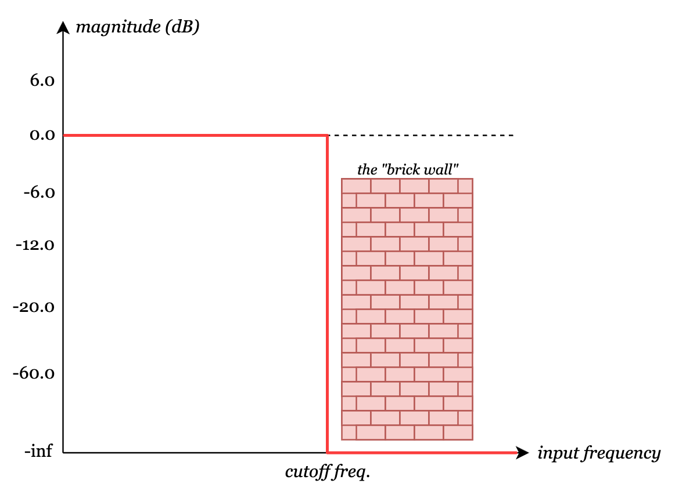
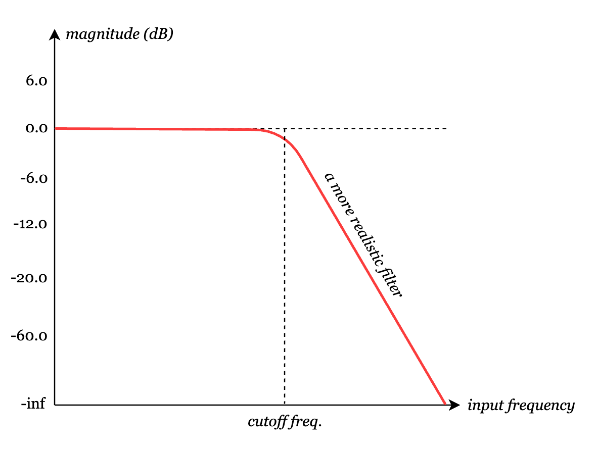
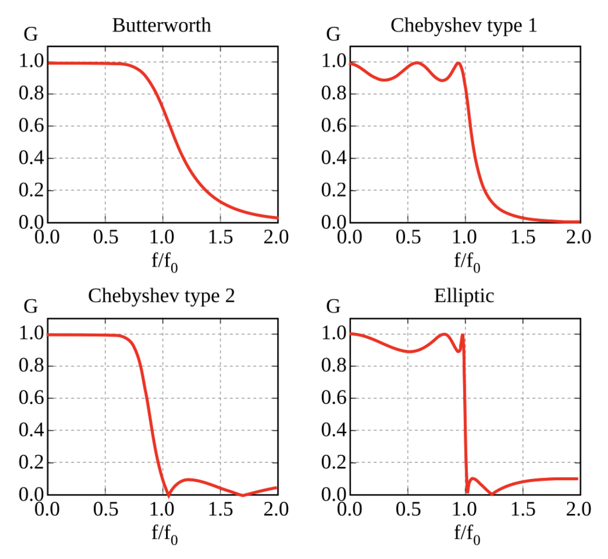
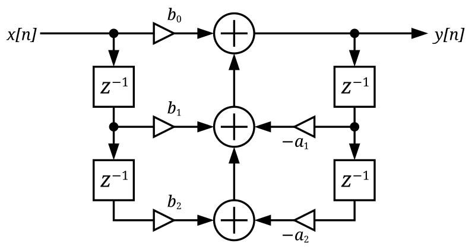
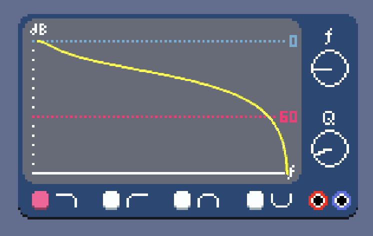
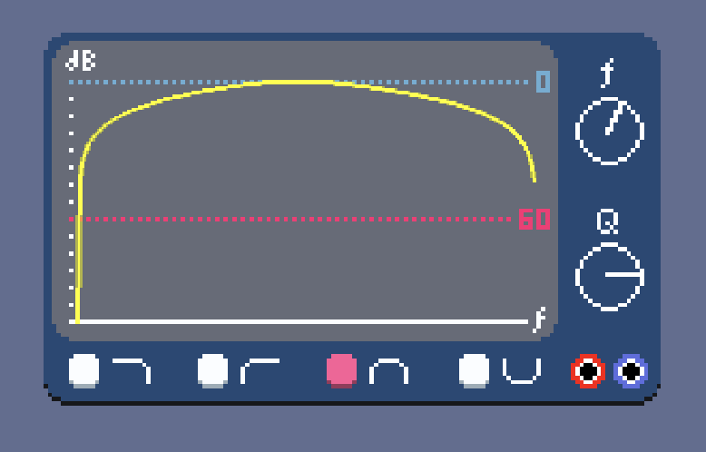
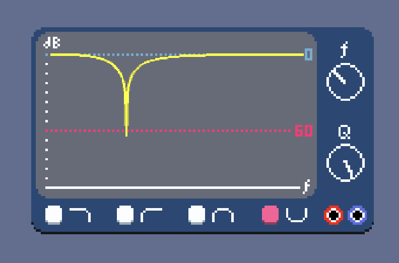

# \[07\] filters

Up to now, we've been able to work with an audio signal's time-series data (1024 frames per block) and do straightforward pointwise manipulations on them. For example, the envelope module multiplies each audio frame pointwise by an amplitude factor that varies along a short section of an envelope curve. Another simple example is the *mixer*: it takes each audio input and sums all of them up pointwise, then normalizes this sum by dividing by the number of inputs.

```C#
// Snippet of MixerNode.cs
public override void Process()
{
    // ...
    var normalizationFactor = 1f / connectedInputIndices.Count;
    for (int i=0; i < AudioConstants.BLOCK_SIZE; i++)
    {
        var sum = 0f;
        foreach (int inputIndex in connectedInputIndices)
        {
            sum += inputBuffers[inputIndex][i];
        }
        targetInputBuffer[i] = sum * normalizationFactor;
    }
}
```

Yet another example is the *gain* module, which multiplies each audio frame pointwise by a constant factor that is adjustable.

```C#
// Snippet of GainNode.cs

// Gain in dB.
public float Gain { get; set; } = 0f;

public override void Process()
{
    // ...
    var linearGain = Mathf.DbToLinear(Gain);
    for (int i=0; i < AudioConstants.BLOCK_SIZE; i++)
    {
        targetBuffer[i] = linearGain * inputBuffer[i];
    }
}
```

But now, I wanted to tackle something that would take me into the frequency domain. I picked the low-pass filter as the first module to do so. It was several weeks of doing what felt like research instead of doing actual development, but in the end I found some holy grails of information that would get me much more than just the low-pass filter!

## researching filters

So I set out to implement a low-pass filter and started going deep into the digital signal processing rabbit hole. This was the first module I'd worked on where I felt like there was a pure knowledge gap that I had to bridge through doing a lot of research.

The first step towards understanding what filters do is that we can plot the frequency spectrum of a time-series audio signal via the [Fourier transform](https://en.wikipedia.org/wiki/Fourier_transform). This is a map of the intensities of frequencies that make up the signal. This frequency spectrum can be re-calculated often enough to show in real-time. Computing the Fourier transform of an audio block efficiently (via the [Fast Fourier Transform](https://en.wikipedia.org/wiki/Fast_Fourier_transform), or FFT) is an entire topic by itself, so it'll be covered in a later entry that talks about reverberation effects. For now, I've leveraged a handy Godot built-in effect called [AudioEffectSpectrumAnalyzer](https://docs.godotengine.org/en/stable/classes/class_audioeffectspectrumanalyzer.html#class-audioeffectspectrumanalyzer), which does the FFT for us.

https://github.com/user-attachments/assets/0d6f5cef-6cf4-4842-976f-93f17703dc52

You can see the audio signal's frequency domain representation in the filter module, while the visualizer shows the audio signal in the time domain.

Now, what a **low-pass filter** does is it attenuates frequencies higher than a specified cutoff frequency, while passing through frequencies lower than the cutoff. Conceptually in the time domain, it "smooths out" or "averages" a jagged, jumpy signal. This behavior can be represented by a *frequency response curve*, which shows the magnitude of the signal output as a function of input frequency. An ideal low-pass filter looks like a "brick wall" in that it has passes through all frequencies below the cutoff at full magnitude and completely attenuates (0% passthrough) all frequencies above the cutoff.



In practice, this instantaneous transition in the frequency response at the cutoff frequency is impossible to achieve. Instead, filters are designed to have a reasonable *roll-off* of dB attenuation per octave.



Here are some examples of real-world frequency response curves. As a spoiler, what we will eventually end up implementing is most similar to the Butterworth filter on the top-left.



So, how to implement such a filter? This is where I started getting lost knowledge-wise and tried to wrap my head around a lot of signal processing theory. I read about [linear time-invariant systems](https://en.wikipedia.org/wiki/Linear_time-invariant_system), impulse responses, convolution, and transfer functions. Although these concepts have been super interesting to learn about, it still felt extremely daunting to try to come up with a way to create a low-pass filter from scratch, especially with the parameters I wanted. I want to be able to choose the cutoff frequency and the "strength" of the cutoff or roll-off behavior, commonly called the Q factor.

What follows is a rambling overview of what I learned. A linear time-invariant (LTI) filter satisfies the following properties:

- **Linearity**: there is a linear mapping between the input signal and the output signal. For example, if $y(t)$ is the output signal for an LTI system with input signal $x(t)$, then the output for $a\cdot x(t)$ where $a$ is a scalar constant is $a \cdot y(t)$. Similarly, the output to the sum of input signals $x(t)$ and $x'(t)$ would be $y(t) + y'(t)$.
- **Time invariance**: Whether we apply an input to the system now or $T$ timesteps from now, the output will be the same except being shifted by $T$ timesteps. In other words, the output of an input $x(t-T)$ is $y(t-T)$.

These two properties allow us to completely define an LTI system by what is called the **impulse response**, which is the time response of the system under an impulse signal. In the discrete case, this is the *delta function* $\delta[t]$:

$$
\delta(t) =
\begin{cases}
  0, & \text{if}\ t = 0\\
  1, & \text{if}\ t \neq 0
\end{cases}
$$

In other words, an impulse signal is a single timeframe of magnitude 1, and nothing else.

The key is that once we have the impulse response $h[n]$ for an LTI system, we can use it as a blueprint to compute the response to any arbitrary input signal! For example, let's say that the impulse response for a "moving average" filter of length 5 is the sequence `[0.2, 0.2, 0.2, 0.2, 0.2]`. This means that we fed the unit impulse signal `[1, 0, 0, ...]` through to this system and got the above impulse response. Then, if we want to figure out the system output for the input signal `[5, 0, 10]`, we scale and time-shift the impulse response to line up with each element in the input signal, and add all those transformed impulse responses together. This operation is called **convolution**.

- The input signal at timestep 0, `5`, is transformed by the impulse response to `[1, 1, 1, 1, 1]`. If the impulse response is $h[t]$, we are computing $3\cdot h[t]$.
- The input signal at timestep 1, `0`, is transformed into all zeroes, or `[0, 0, 0, 0, 0, 0]`: $0 \cdot h[t-1]$. Note that the output sequence is six elements in this case since we start applying the impulse response at timestep 1, and the impulse response is of length 5.
- The input signal at timestep 2, `10`, is transformed into $10\cdot h[t-2]$: `[0, 0, 2, 2, 2, 2, 2]`.
- Finally, we sum up all these output sequences pointwise to arrive at our final output signal: `[1, 1, 3, 3, 3, 2, 2]`. Note that it kind of looks like the input signal was smoothed and spread out: moving average filters are actually a form of low-pass filter!

This was a fairly contrived example and I went into great detail here, but hopefully that makes LTI systems as well as what convolution does a little clearer. I don't think I "got" it until I saw this kind of slow, contrived example. [Chapter 6](https://www.analog.com/media/en/technical-documentation/dsp-book/dsp_book_Ch6.pdf) of The Scientist and Engineer's Guide to Digital Signal Processing (as well as the book in general) has been an amazing resource.

The **transfer function** of a discrete LTI system is the [Z-transform](https://en.wikipedia.org/wiki/Z-transform) of the impulse response, and is the ratio of the output over the input in the frequency domain. This allows for analysis of the frequency response of the LTI system. The magical thing is that transfer functions can be converted into a *difference equation*, which gives a succinct form for computing the time-series output of a given input signal!

For example, let's take the moving average filter again but give it a length of 3, so the impulse response looks like `[1/3, 1/3, 1/3]`. More formally, using the delta function, it would look like:

$$h[n] = \frac{1}{3}\delta[n] + \frac{1}{3}\delta[n-1] + \frac{1}{3}\delta[n-2]$$

The block diagram of the system is the following:


Which gives the following transfer function:

$$H(z) = \frac{1}{3} + \frac{1}{3}z^{-1} + \frac{1}{3}z^{-2} = \frac{1}{3}(1 + z^{-1} + z^{-2})$$

To turn this into a difference equation, we treat the numerator as the Z-transformed output signal, and the denominator as the Z-transformed input signal:

$$H(z) = \frac{Y(z)}{X(z)} = \frac{\mathcal{Z}\{y[n]\}}{\mathcal{Z}\{x[n]\}}$$

$$Y(z) = H(z)\cdot X(z)$$

$$Y(z) = \frac{1}{3}[X(z) + X(z)z^{-1} + X(z)z^{-2}]$$

Taking the inverse Z-transform gives us the time-series difference equation:

$$y[n] = \frac{1}{3}x[n] + \frac{1}{3}x[n-1] + \frac{1}{3}x[n-2]$$

Okay, this was yet again a pretty contrived example. But the key takeaway is that we can take a system of a filter, possibly inspired from analog circuits, draw its block diagram, analyze its transfer function, then derive the difference equation from it that allows us to implement the filter computationally efficiently.

(Note: one alternative to everything we've been doing is to take the Fourier transform of the input signal into frequency space, modify the frequency space in the ways we want, then inverse Fourier transform back into an output signal. This is certainly possible, but 1\) it's overkill for what we want for now, and 2\) there will be opportunities to revisit this approach to make some more creative audio modules down the road.)

Moving average filters are examples of finite impulse response (FIR) filters: as the name implies, the impulse response is of finite length. However, what if we introduced some feedback where the output signal at previous timesteps actually has an influence on later timesteps? Then we get infinite impulse response (IIR) filters where feedback comes into play! If we only have one timestep of delay, we get a *first order recursive linear filter*, which is not bad but the frequency analysis ends up showing that the roll-off could be better. Alternatively, consider a *second order* filter, where we have a recursive system with two delay timesteps.



Higher-order filters run into stability issues due to feedback, so it turns out that the second-order filter is the sweet spot in terms of filter design that strikes a balance between decent frequency response curves and stability. In addition, biquad filters can be easily chained together to give more complex filtering schemes. The transfer function of the block diagram above is:

$$H(z) = \frac{b_0 + b_1 z^{-1} + b_2 z^{-2}}{1 + a_1 z^{-1} + a_2 z^{-2}}$$

These systems are called **biquad filters** because the transfer function is a ratio of two quadratic functions. Let's calculate the difference equation:

$$Y(z) = X(z) \cdot H(z)$$
$$\implies Y(z) + Y(z)a_1 z^{-1} + Y(z)a_2 z^{-2} = X(z)b_0 + X(z)b_1 z^{-1} + X(z)b_2 z^{-2}$$
$$\implies y[n] + a_1 y[n-1] + a_2 y[n-2] = b_0 x[n] + b_1 x[n-1] + b_2 x[n-2]$$
$$\implies y[n] = b_0 x[n] + b_1 x[n-1] + b_2 x[n-2] - a_1 y[n-1] - a_2 y[n-2]$$

This gives a super succinct way for us to implement this biquad filter in our system! When we call `Process()` on our filter module and want the output for the "current" audio frame $n$, we compute this difference equation that depends on the coefficients $b_0, b_1, b_2, a_1, a_2$, the last two output audio frames $n-1$ and $n-2$, and finally the current and last two input audio frames $n$, $n-1$, and $n-2$. The implementation is shockingly readable with all the knowledge we've accrued in mind:

```C#
// Snippet of FilterNode.cs
public override void Process()
{
    // ...
    for (int i=0; i < AudioConstants.BLOCK_SIZE; i++)
    {
        xn0 = inputBuffer[i];
        temp[i] = (xn0 * b0 / a0) + (xn1 * b1 / a0) + (xn2 * b2 / a0) - (yn1 * a1 / a0) - (yn2 * a2 / a0);

        yn2 = yn1;
        yn1 = temp[i];
        xn2 = xn1;
        xn1 = xn0;
        targetBuffer[i] = temp[i];
    }
}
```

(Note that $a_0$ comes up here because it's actually a sneaky hidden parameter that is divided through so that we get a normalized $1$ in the denominator of the transfer function, as it makes the difference equation easier. But technically, all the coefficients in the normalized transfer function are divided by $a_0$.)

So what *are* these coefficients? Do they represent a low-pass filter? The beautiful thing is that the biquad filter can represent nearly *all* filter types! The only difference is the choice of coefficients, which are a function of the type of filter (low-pass, high-pass, band-pass, notch), the mix rate frequency $f_s$ (44,100 Hz), the cutoff frequency $f_0$, and the Q factor (a measure of "damping" of the system).

The holy grail, the formula for determining the exact coefficient values given the above parameters, comes from an incredible [biquad filter audio cookbook](https://www.musicdsp.org/en/latest/Filters/197-rbj-audio-eq-cookbook.html) from Robert Bristow-Johnson that dates back to at least 2005, and most likely earlier. These values can be computed through cold hard mathematical analysis, but my brain is truly not wrinkly enough for that, so I thank RBJ from the bottom of my heart for providing me these magical coefficient values.

```C#
// Snippet of FilterNode.cs
public void SetFilterParameters()
{
    w0 = Mathf.Tau * f0 / fs;
    alpha = Mathf.Sin(w0) / (2f * qFactor);
    var cs = Mathf.Cos(w0);

    if (type == FilterType.LowPass)
    {
        a0 = 1f + alpha;
        a1 = -2f * cs;
        a2 = 1f - alpha;
        b0 = (1f - cs) / 2f;
        b1 = 1f - cs;
        b2 = (1f - cs) / 2f;
    }
    else if (type == FilterType.HighPass)
    {
        a0 = 1f + alpha;
        a1 = -2f * cs;
        a2 = 1f - alpha;
        b0 = (1f + cs) / 2f;
        b1 = -1f - cs;
        b2 = (1f + cs) / 2f;
    }
    else if (type == FilterType.BandPass)
    {
        a0 = 1f + alpha;
        a1 = -2f * cs;
        a2 = 1f - alpha;
        b0 = alpha;
        b1 = 0f;
        b2 = -1f * alpha;
    }
    else if (type == FilterType.Notch)
    {
        a0 = 1f + alpha;
        a1 = -2f * cs;
        a2 = 1f - alpha;
        b0 = 1f;
        b1 = -2f * cs;
        b2 = 1f;
    }
}
```

One final thing before showing a demo of what the filter module is capable of: I wanted to be able to show the actual frequency response of the filter module's current configuration in real time. This kind of meant that I needed to find a closed-form formula of the frequency response. After much searching, I was able to find it from [this helpful website called BiQuadDesigner](https://arachnoid.com/BiQuadDesigner/), and oh boy is it gnarly:

$$f(\phi)^2 = \frac{16 \ b_0 b_2 \phi^2 + (b_0 + b_1 + b_2)^2 - 4(b_0 b_1 + 4 b_0 b_2 + b_1 b_2)\phi}{16\ a_2 \phi^2 + (a_1 + a_2 + 1)^2 - 4(a_1 a_2 + a_1 + 4\ a_2)\phi}$$

where $\phi = \sin(\frac{2\pi f_0}{2 f_s})^2$. Was this painful to transcribe into code? Oh yes. Was it worth it? Oh yes!

```C#
// Snippet of FilterPlot.cs
public float GetDbValue(float freq)
{
    var n = GetParent<Filter>().audioNode;
    var a1 = n.a1 / n.a0;
    var a2 = n.a2 / n.a0;
    var b0 = n.b0 / n.a0;
    var b1 = n.b1 / n.a0;
    var b2 = n.b2 / n.a0;

    var phi = Mathf.Pow(Mathf.Sin(Mathf.Tau * freq / (2f * AudioConstants.MIX_RATE)), 2f);
    var r1 = Mathf.Pow(b0 + b1 + b2, 2f);
    var r2 = 16f * b0 * b2 * phi * phi;
    var r3 = 4f * (b0 * b1 + 4f * b0 * b2 + b1 * b2) * phi;
    var r4 = 16f * a2 * phi * phi + Mathf.Pow(1f + a1 + a2, 2f) - 4f * (a1 + 4 * a2 + a1 * a2) * phi;
    var r = (r1 + r2 - r3) / r4;
    r = r < 0f ? 0f : Mathf.Sqrt(r);
    return r <= 0f ? -100f : 20f * (float)Math.Log10(r);
}
```





High-pass filters (the second option) function similarly to low-pass filters, except it cuts frequencies *below* a threshold instead. Band-pass filters are kind of like a combination of low and high-pass in that it passes a band of frequencies but cuts frequencies below and above the band. Notch filters are like the inverse of band-pass in that it cuts a band of frequencies but pass frequencies outside that band.

Here's a demo of how a square wave gets affected by the filter:

https://github.com/user-attachments/assets/e41f8cff-ea2c-41b1-995f-1c0b4530ef9c

One thing that is slightly impeding a proper test of these filters is that the frequency spectrums we can generate with our current wave generators are relatively low. Ideally we'd like to test the filter on a signal that has an equal amount of energy/amplitude across the entire frequency spectrum. This is called white noise, and the naive implementation of it is quite simple: we literally just push random samples to the audio buffer!

```C#
// Snippet of WhiteNoiseNode.cs
public override void Process()
{
    // ...

    // Normalize to [-0.5, 0.5] instead of [-1, 1] as the latter is too loud.
    for (int i=0; i < AudioConstants.BLOCK_SIZE; i++)
    {
        float randomFloat = (float)random.NextDouble();
        targetBuffer[i] = randomFloat - 0.5f;
    }
}
```

https://github.com/user-attachments/assets/3b6f8865-eb7e-4ca3-94b8-e3303db2c320

Now with our filter, we get a better demo of how the filter affects the sound.

https://github.com/user-attachments/assets/fa776e94-f6ea-4824-b3ed-25973723954e

Everything is still pretty prototypal, so coarse dial controls are fine for now. However, in the near future, I want to add the option for finer-grain controls on everything so that one can target exact frequencies and Q values if one so wishes. This applies to other controls as well, like specifying exact milliseconds for ADSR dials.

#### <<< [\[06\] polyphony](./06_polyphony.md) | [\[08\] midi modules](./08_midi-modules.md) >>>
