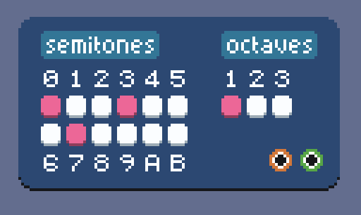
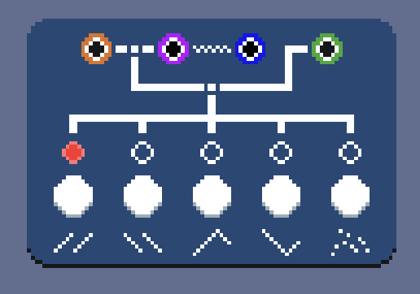
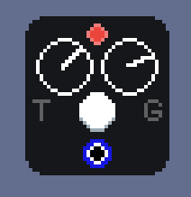
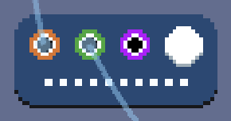

# \[08\] more midi modules

Just as how we can route audio through our system freely and manipulate it in a modular way, I want to be able to work with other data types modularly as well. The two others we've worked with so far are *MIDI signals* and *trigger signals*. It stands to reason that MIDI signals should be able to be manipulated as freely as audio. This entry will cover a few exploratory modules that play around with this concept.

MIDI signals, especially the pitch component of a MIDI signal, can be viewed as a *musical blueprint* for a sound. MIDI signals can ostensibly be passed around and transformations can be done on them, but they are not realized into an actual audio signal until they are fed into an audio generator such as a sine wave module which takes the MIDI signal as input.

One example of this that we've seen already is the keyboard, which does not have an audio output. When a key is pressed or released, the keyboard only sends the `NoteOn` and `NoteOff` MIDI signals for the key's corresponding pitch, along with an associated trigger signal that can be used to control things like envelopes. Since the keyboard's core functionality is based on MIDI signals, we can consider it a *MIDI module* as opposed to an *audio module*. The midiplex module in the [polyphony entry](./06_polyphony.md) is another example of a MIDI module.

## chord generators

A **chord** in music is the unison of two or more notes at the same time. Usually, the chord is characterized by the root (lowest) note and the intervals between the root and other notes in the chord.

One useful MIDI transformation is to take a single MIDI note as input and to output a specific chord with the input note as the root. If we combine a module that does this with the midiplex, we can play chords by only pressing a single key! To prototype this, I devised a **chord generator** where one can pick the desired semitones in the chord.



For example, a minor triad can be built with the root (0 semitones) and two other intervals above that root: the minor third (3) and perfect fifth (7). A major triad is similar, except instead of using a minor third, we use a major third (4 semitones). Here's an example!

https://github.com/user-attachments/assets/28e5a5ae-06aa-4afe-a8af-d8606e489ccc

There's also an option to include copies of all selected semitones across multiple octaves. And by omitting semitone 0 and only setting a single other semitone (let's say 1), we get a sort of upwards transposition effect.

https://github.com/user-attachments/assets/b04515be-4822-4f46-95ac-9a105f778bd8

## melodizers

I really want something equivalent to the functionality of an **arpeggiator**, which takes a chord normally played in unison and staggers it into an [arpeggio](https://en.wikipedia.org/wiki/Arpeggio) based on the notes in the held chord. This is something that is best done in MIDI-space rather than audio-space, so again this will be another example of a MIDI module.

Typically, I have seen arpeggiators implemented as a built-in feature on a digital instrument, and also coming with the chord generation functionality so that one can just pick a scale or chord type and press a note and hear the arpeggiated chord based on that one note. To try to differentiate between these more integrated implementations and the more modular approach I'm trying to do based on pure MIDI signals, I'm calling the arpeggiation module the **melodizer** for now. (Honestly though, I think I might just rename this back to an arpeggiator.)



The melodizer keeps track of all currently held pitches in a sorted list and periodically sends MIDI outputs for each pitch in this list sequentially, one at a time, based on a certain pattern. From left to right, these patterns are: up, down, up-then-down, down-then-up, and random.

```C#
// Snippet of Melodizer.cs
private HashSet<int> pitches;
private ImmutableSortedSet<int> sortedPitches;
private int pitchIndex = 0;

// ...

public override void OnMidiInput(InputEventMidi midiEvent)
{
    if (midiEvent.Message == MidiMessage.NoteOn)
    {
        pitches.Add(midiEvent.Pitch);
        sortedPitches = pitches.ToImmutableSortedSet();
    }
    if (midiEvent.Message == MidiMessage.NoteOff)
    {
        pitches.Remove(midiEvent.Pitch);
        sortedPitches = pitches.ToImmutableSortedSet();
    }
}
```

The period in which the sequential MIDI signal outputs are sent depends on a trigger signal. Each time a trigger signal is received, the pitch `sortedPitches[pitchIndex]` is converted into a MIDI event and sent, and then `pitchIndex` is updated based on the melody type, almost like a state machine.

```C#
// Snippet of Melodizer.cs
public override void OnTriggerInput(bool triggered, int midiPitch, int index)
{
    // If there are no currently held pitches, nothing happens.
    if (pitches.Count == 0)
    {
        return;
    }

    // We keep track of the last sent MIDI note so that we can send the correct NoteOff signal when a trigger is released.
    if (!triggered)
    {
        _ReleaseLastMidiNote();
        return;
    }

    var midiEvent = new InputEventMidi();
    midiEvent.Pitch = sortedPitches[pitchIndex];
    midiEvent.Message = MidiMessage.NoteOn;

    EmitSignal(SignalName.MidiEvent, midiEvent, audioNode.nodeId, 0);
    EmitSignal(SignalName.TriggerEvent, true, midiEvent.Pitch, audioNode.nodeId, 0);

    // If for some reason a second trigger is received before the first trigger is released, we track this case as well and release the note from the first trigger before we trigger the second note.
    if (!lastMidiNoteReleased)
    {
        _ReleaseLastMidiNote();
    }
    lastMidiEvent = midiEvent;
    lastMidiNoteReleased = false;

    if (melodyType == MelodyType.Up)
    {
        pitchIndex = pitchIndex >= pitches.Count - 1 ? 0 : pitchIndex + 1;
    }
    else if (melodyType == MelodyType.Down)
    {
        pitchIndex = pitchIndex <= 0 ? pitches.Count - 1 : pitchIndex - 1;
    }
    else if (melodyType == MelodyType.Random)
    {
        var randomIndex = randomizer.Next(pitches.Count);
        pitchIndex = randomIndex;
    }
    // One can extrapolate logic for UpDown and DownUp.
    // ...
}
```

Okay, so if a trigger signal is responsible for dictating the speed of the arpeggiation, then what module can source these trigger signals? Currently, the only originator of trigger signals is the keyboard module, and it would be pretty limiting to rely on that. The answer is to introduce a tempo/metronome module!



https://github.com/user-attachments/assets/7ca9ad29-61f6-43fb-b6f6-41b361f966d1

(This is a module that I have not bothered to redesign from this very initial black background. I honestly think every single module I've worked on so far could use a rework, and so I'm not sweating the designs too much and pressing on with prototyping as many different modules as possible to have a powerful enough system before iterating on and trying to really polish module designs.)

The metronome module has two dials, one for tempo and one for *gate*. The tempo dictates the speed at which trigger signals are sent. A higher gate means that the trigger signal is held for a longer duration of time with respect to the tempo. For example, if we say a *beat* is the distance between two trigger signals, the gate set on the lowest setting means the trigger signal is held for maybe 5% of a beat, and the highest setting means the signal is held for ~95% of the beat. (For the musically inclined, low gate is more staccato, high gate is more legato.)

Now we can combine the keyboard, an optional chord generator, metronome, and melodizer to create a MIDI arpeggio that can feed into an audio generator!

https://github.com/user-attachments/assets/afdcce33-ebbc-449d-90cf-eab1fa9097de

## MIDI latches

For the melodizer, as long as a note's `NoteOn` message has been received and its `NoteOff` message has not, a note is considered to be held. This has useful implications if we want to "latch" notes by sending and holding some MIDI signals with a keyboard and then have those signals continue to hold when we release, so that we can do something else with the keyboard.



I whipped up a cute little module called a **MIDI latch** that does just that! When it receives MIDI signals, it will pass them through its MIDI output, but will release them *if and only if* it receives a trigger signal to release. (Equivalently, press the button to release.) This is actually super interesting because it acts as a sort of writable MIDI data cell! I currently only have it configured to remember ten notes, but this will be expanded in the future.

```C#
public override void OnMidiInput(InputEventMidi midiEvent)
{
    if (midiEvent.Message != MidiMessage.NoteOn)
    {
        return;
    }

    if (pushedMidiEvents.Count == _capacity)
    {
        GD.Print("Midi latch is at capacity, can't write any more data!");
        return;
    }

    if (pitches.Contains(midiEvent.Pitch))
    {
        return;
    }

    EmitSignal(SignalName.MidiEvent, midiEvent, audioNode.nodeId, 0);
    pushedMidiEvents.Add(midiEvent);
    pitches.Add(midiEvent.Pitch);
}

private void _ClearLatch()
{
    foreach (var midiEvent in pushedMidiEvents)
    {
        var noteOffEvent = new InputEventMidi();
        noteOffEvent.Pitch = midiEvent.Pitch;
        noteOffEvent.Message = MidiMessage.NoteOff;
        EmitSignal(SignalName.MidiEvent, noteOffEvent, audioNode.nodeId, 0);
    }
    pushedMidiEvents.Clear();
    pitches.Clear();
}
```

Now we can "set and forget" an arpeggio while we play something else entirely on top of it!

https://github.com/user-attachments/assets/391e5545-db37-4696-98f1-7b1bf89ebe19

## final word

One could imagine not needing a keyboard module at all, but getting to pick and choose via a UI a palette of pitches, chord types, and scale types. This exploration of MIDI modules with arpeggiation as the end goal was a good start, but there's a lot of fun concepts I can try building in the future!

#### <<< [\[07\] filters](./07_filters.md) | [\[09\] recording](./09_recording.md) >>>
