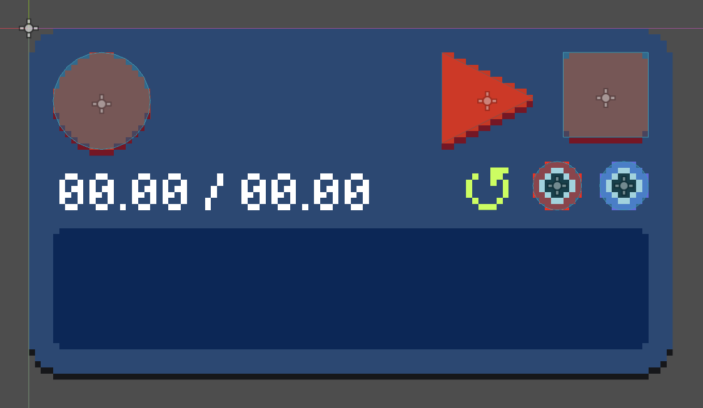
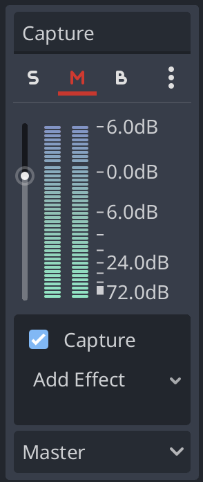
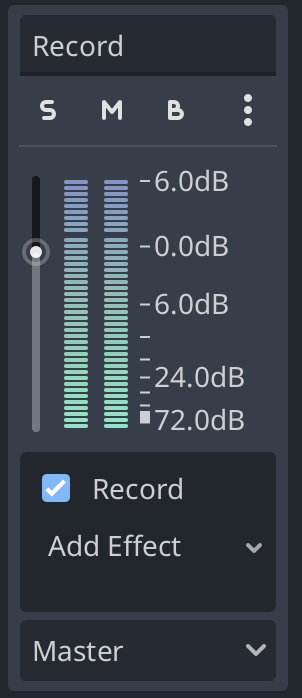

# \[09\] recording

The ability to record audio and play it back within the system is a core piece of functionality that allows for composition and experimentation. Music in this system need not be entirely live nor entirely recorded.

There are three main types of modules that come to mind when I think of recording:

- **Recorders** focus on the function collecting and saving audio streamed to an input buffer. This recorded data can be turned into an audio sample for further playback or manipulation.

- **Microphones** capture audio input from an physical external source, such as a microphone or a port on an audio interface like a [FocusRite Scarlett device](https://us.focusrite.com/products/scarlett-solo). This captured audio gets streamed to an audio output. Microphones do not necessarily perform the function of recording!

- **Samplers** work with, well, audio samples: they can play them back, crop them, chop them up, and maybe even tweak their playback speed or other acoustic characteristics. Samplers can therefore create new samples by combining and/or modifying other samples.

- **Loopers** are a type of recorder, but they  specialize in "over-dubbing" or layers tracks on top of each other in a looping succession. This allows for composing songs with multiple parts one part at a time.

In this entry, I'll focus on the first two types: recording from an input buffer, and streaming audio from an external audio input such as a microphone. The basic recorder module I have in mind will support recording, as well as basic playback functionality: starting, stopping, and looping (without the overdub functionality that dedicated looper modules provide). I'll also go over a "global recording" feature that will allow us to export music from the system for the first time!

## recorder module



The visuals of the recorder module, as with everything, is still but a prototype. However, I like this design more than I thought :\) There's just something satisfying about the big red buttons and seeing `00.00 / 00.00`.

To toggle playback looping on and off (as shown by the green loop indicator), hold the play button for a sufficiently long time. To clear the current recording, hold down the stop button. The audio being recorded is shown in the bottom panel. During playback, there is a play indicator that shows the current position. The timestamps above the bottom panel show the current time and the total recording duration, respectively.

There's definitely some things I want to tweak with the visuals eventually, but I really enjoy the act of _designing_ these modules and making them aesthetic while still being compact yet affording functionality that is hopefully intuitive to use. I would say that there is just as much time spent sketching out a module's apperance and mocking it up in Aseprite as there is time spent in coding and framing it in Godot.

The current implementation of the recorder's audio node is quite naïve in that the recorded audio data is just stored in a potentially huge list of audio frames that is capped.

```C#
// Snippet of RecorderNode.cs
public class RecorderNode : AudioNode
{
    public bool recording = false;
    public bool playing = false;
    public bool looping = false;

    private int playIndex = 0;

    private float[] inputBuffer;

    private const int MAX_RECORDING_LENGTH_IN_SECONDS = 30;
    private int MAX_RECORDING_BUFFER_SIZE = (int)AudioConstants.MIX_RATE * MAX_RECORDING_LENGTH_IN_SECONDS;

    public List<float> recordingBuffer;
    // ...
```

Certainly, this approach of just storing arbitrary amounts of 1.4-million-length arrays in memory will not hold up. In the near future, I'd like all recordings to be saved to a dedicated [AudioStreamWAV](https://docs.godotengine.org/en/stable/classes/class_audiostreamwav.html) resource using the built-in [AudioEffectRecord](https://docs.godotengine.org/en/stable/classes/class_audioeffectrecord.html#class-audioeffectrecord). By working with AudioStreamWAV objects instead of the raw audio data, it should be easier to save and load recorder modules _with the included recording_. Programs like Ableton deal with these kinds of recording snippets [similarly](https://www.ableton.com/en/live-manual/12/recording-new-clips/#where-are-the-recorded-samples), by saving them as temporary audio files that can be referred to by file path.

But for now, let's keep the abomination that is the 1.4-million-length list that represents the recorded audio, since it works for now! Let's expose some functions for the recorder's entity to use for displaying state:

```C#
public void ClearRecordingBuffer()
{
    recordingBuffer.Clear();
}

public void ResetPlayIndex()
{
    playIndex = 0;
}

public float GetRecordingLength()
{
    return recordingBuffer.Count / AudioConstants.MIX_RATE;
}

public float GetPlayMarkerTime()
{
    return playIndex / AudioConstants.MIX_RATE;
}
```

The play index is the current audio frame. Since there are a `MIX_RATE` number of samples per second, we can get the current timestamp (the first number in the `00.00 / 00.00` display) by dividing the current audio frame by this mix rate.

The two main methods are `Process()` and `Record()`. Let's go over `Process()` first.

```C#
public override void Process(int outputIndex)
{
    // ...

    if (recording)
    {
        Record();
        return;
    }

    for (int i=0; i < AudioConstants.BLOCK_SIZE; i++)
    {
        if (!playing || recordingBuffer.Count == 0)
        {
            // If the recorder is not being used, pass through the input audio.
            targetBuffer[i] = inputBuffer[i];
            continue;
        }

        // If we've hit the end of the recording buffer:
        if (playIndex >= recordingBuffer.Count - 1)
        {
            // If looping is on, reset the index and keep playing from the beginning..
            if (looping)
            {
                ResetPlayIndex();
            }
            else
            {
                // ..otherwise, stop playing.
                playing = false;
            }
            return;
        }

        // Otherwise, we are playing back a recording:
        // copy the current slice of the recording buffer to the output buffer.
        targetBuffer[i] = recordingBuffer[playIndex];
        playIndex++;
    }
}
```

If we're recording, we do a separate thing which we'll get to soon. Otherwise, we're either playing the recording back, or not. If we're playing, in general, we write the current position of the recording to the output buffer. If we're not playing, then the recorder isn't really being used, but we still want to hear the audio that goes through the recorder: therefore, we pass the audio through.

```C#
private void Record()
{
    if (recordingBuffer.Count > MAX_RECORDING_BUFFER_SIZE)
    {
        GD.Print("Maximum recording size reached, stopping recording");
        recording = false;
        return;
    }

    // Copy the input buffer to the end of the recording buffer.
    recordingBuffer.AddRange(inputBuffer);

    // To hear what is being recorded, the input buffer is also passed through to the target buffer.
    // ...
    for (int i=0; i < AudioConstants.BLOCK_SIZE; i++)
    {
        targetBuffer[i] = inputBuffer[i];
    }
}
```

It turns out that the act of recording is super easy in audio block land! Just push the input buffer to the recording buffer, and also pass through the audio so we hear what's being recorded.

When everything is hooked up and implemented, we now have our first recorded sounds!


## microphone module

The strategy for capturing external audio input involves instantiating an [AudioStreamMicrophone](https://docs.godotengine.org/en/stable/classes/class_audiostreammicrophone.html) to an AudioStreamPlayer attached to the microphone entity. The AudioStreamPlayer, true to its name, plays an audio stream, but the catch is that it plays to a specified [audio bus](https://docs.godotengine.org/en/stable/tutorials/audio/audio_buses.html). Until now, we've largely been able to skirt around Godot's audio bus system because we've essentially been building our own audio routing system and haven't needed it (except the Master bus, which speaker modules push to). However, we now need to adhere to the spec of the AudioStreamPlayer and find a way to capture audio from an audio bus and integrate it with the system.

Before we talk about that, though, let's briefly discuss the AudioStreamMicrophone. Instead of the typical relationship between an AudioStream and its AudioStreamPlayer where the AudioStream is a preexisting, saved recording that is played back, the AudioStreamMicrophone plays back audio from the _current input device_ in real time. There can only be one current input device at a time (quite unfortunately) and is set by [AudioServer.InputDevice](https://docs.godotengine.org/en/stable/classes/class_audioserver.html#class-audioserver-property-input-device). The list of available input devices can be retrieved with [AudioServer.GetInputDeviceList()](https://docs.godotengine.org/en/stable/classes/class_audioserver.html#class-audioserver-method-get-input-device-list). This will allow the microphone module to select which input to use. Finally, to enable audio input, `ProjectSettings.audio/driver/enable_input` must be true.

Okay, back to audio buses: we can use [AudioEffectCapture](https://docs.godotengine.org/en/stable/classes/class_audioeffectcapture.html#class-audioeffectcapture) as a sort of inverse operation to the [AudioStreamGenerator](https://docs.godotengine.org/en/stable/classes/class_audiostreamgenerator.html). Whereas speaker modules use the latter to push audio data to a buffer, microphone modules use the former to read audio data _from_ a buffer. As such, AudioEffectCaptures also come with a `BufferSize` parameter that should be chosen carefully to balance latency and performance. There are methods like `GetBuffer(int frames)`, `GetFramesAvailable()`, and `CanGetBuffer(int frames)`, similar to AudioStreamGenerators, to pop audio frames pushed by the AudioStreamMicrophone.



To recap, the strategy is for the AudioStreamPlayer's AudioStreamMicrophone to push external audio input data to the above audio bus named Capture. This bus has one audio effect, an AudioEffectCapture, which collects this audio into a capture buffer. The microphone module then integrates the data from the capture buffer into the rest of the system by calling the microphone node's `Process()` method, which pulls a block-size's worth of audio data from the capture buffer.

All audio buses must eventually route to Master, but we can actually mute this audio bus so that no audio gets leaked to Master, but we can still capture the audio on this bus. That's why the red "M" symbol is selected.

## resampling is hard

There is one huge caveat to the microphone setup that gave me a lot of headache before I realized how I could fix things easily. Originally, I had been working with a mix rate of 44,100 Hz. However, when I was trying to get the microphone working, I was hearing a lot of popping, which meant that the microphone node's `Process()` was pulling audio from the capture buffer faster than the AudioStreamMicrophone was pushing audio into it. I eventually realized that this was because there is an _input mix rate_ that is not necessarily the same as the _output mix rate_. Although the project's output mix rate was indeed 44,100 Hz, the input mix rate (retrieved via [AudioServer.GetInputMixRate](https://docs.godotengine.org/en/stable/classes/class_audioserver.html#class-audioserver-method-get-input-mix-rate)) was 48,000 Hz. So far, I have not found a good way to change the input mix rate, which is a current limitation of Godot.

If we can't change the input mix rate from 48,000 Hz, there are two ways around this: either try to resample the microphone's input from 48k to 44.1k, or increase the project's output mix rate to 48k.

I spent a long time trying to implement my own resampling algorithms. The [general strategy for sample-rate conversion](https://en.wikipedia.org/wiki/Sample-rate_conversion) seems to be two main steps:

1. If the ratio of the two sample rates is a rational number $\frac{L}{M}$, first produce an intermediate signal by inserting $L-1$ zeroes between each sample. For example, if our signal is $[3, 5, 7]$ and our conversion ratio is $\frac{2}{3}$, the intermediate signal would be $[3, 0, 5, 0, 7]$.
2. Low-pass filter this signal to smooth it out, so as to produce an upsampled interpolation of the signal. Then pick every $M$-th sample to get the final audio signal.

Step 1 is fairly straightforward, but I got hung up on step 2 and didn't figure out a way to get this to work after a few days of trying. :\( Around this point, I realized that I should probably just try to increase the project's mix rate to 48k. Fortunately, this mix rate still falls well within our specifications of wanting to process 1,024 frames up to 60 times per second. Thankfully, this magically resolved the popping issue and the microphone was now working relatively smoothly! Eventually, I want a rematch and conquer the challenge of resampling, but for now I'm happy to move on.


## feedback

Now that we have a microphone to record external input, which flows through the system and gets played back on at external output, we can create a feedback loop where past outputs contribute to the current input.

A secondary inspiration for this project is the class I took alongside Interactive Music Systems called Electronic Music Composition, taught by an eccentric professor named peter whincop. It was a refreshing counterpoint to dreary western Music Theory 101 where instead of diatonic harmony, the course's first principles were rooted in noise, sounds, recording, and feedback. Our first assignment was to sit in the class's recording booth with a microphone and a glass, and using nothing but the glass, silence, a microphone, and an equalizer, use feedback to create an audio composition.

Unfortunately, I ended up dropping the class once the pandemic hit and I focused on my workloads in other classes, which I regret knowing my current life path now. But being able to play around with feedback like this in my project feels full circle and made me think back to that first assignment for Electronic Music Composition, huddled in the music building's recording booth by myself at 1am on a brisk February night.


## global recording

For our last feature, we'll tackle recording the speaker module's output in real time and actually saving and exporting it as a WAV file. We'll declare a 'recording mode,' bind a keyboard shortcut to toggle it, and tweak the speaker module to use the `Record` audio bus instead of `Master` when we're globally recording:

```C#
private AudioStreamPlayer _GetPlayer()
{
    if ((entity as SpeakerEntity).globals.IsRecording)
    {
        return entity.GetNode<AudioStreamPlayer>("AudioStreamRecorder");
    }
    else
    {
        return entity.GetNode<AudioStreamPlayer>("AudioStreamPlayer");
    }
}
```



The Record audio bus has an [AudioEffectRecord](https://docs.godotengine.org/en/stable/classes/class_audioeffectrecord.html#class-audioeffectrecord) that manages the recording of the audio bus into an AudioStreamWAV. Unlike the Capture bus, we don't mute this bus so that we still play whatever's being recorded to the external speaker.

```C#
private void _ToggleRecording(string dummy)
{
    if (!globals.IsRecording)
    {
        // Start recording.
        globals.IsRecording = true;
        recordingLabel.Visible = true;
        var recordBusIndex = AudioServer.GetBusIndex("Record");
        var recordEffect = (AudioEffectRecord)AudioServer.GetBusEffect(recordBusIndex, 0);
        recordEffect.SetRecordingActive(true);
    }
    else
    {
        // Stop recording, save the recorded audio stream to WAV.
        globals.IsRecording = false;
        recordingLabel.Visible = false;
        var recordBusIndex = AudioServer.GetBusIndex("Record");
        var recordEffect = (AudioEffectRecord)AudioServer.GetBusEffect(recordBusIndex, 0);
        recordEffect.SetRecordingActive(false);
        var recordedWav = recordEffect.GetRecording();
        var error = recordedWav.SaveToWav("user://testexport.wav");
        if (error == Error.Ok)
        {
            GD.Print("Saved recording to user://testexport.wav");
        }
    }
}
```

With this, when we toggle the recording mode off, we'll get a notification and find that we've saved the recording in a specific project folder in our file system under `testexport.wav`!

It's a rough implementation for now: there's no specifying where we save the recording or what we want to name it. But it's a good start.

#### <<< [\[08\] midi modules](./08_midi-modules.md) | [\[10\] saving and loading](./10_saving-and-loading.md) >>>
